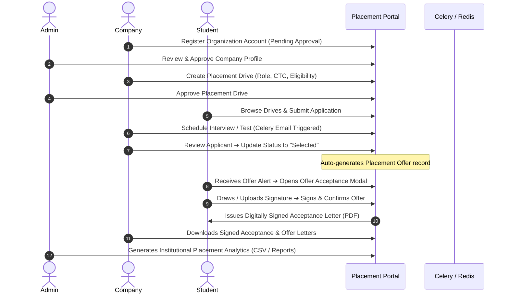

<div align="center">

# 🎓 Placement Portal Application

### *An Enterprise-Grade Campus Recruitment & Placement Automation Platform*

[](https://python.org)
[](https://flask.palletsprojects.com/)
[](https://vuejs.org/)
[](https://getbootstrap.com/)
[](https://sqlite.org/)
[](https://docs.celeryq.dev/)
[](https://redis.io/)
[](https://opensource.org/licenses/MIT)

</div>

---

## 📌 Table of Contents
- [Overview](#-overview)
- [New Features & "Enterprise" Upgrades](#-new-features--enterprise-upgrades)
- [Architecture & Tech Stack](#-architecture--tech-stack)
- [End-to-End Workflows](#-end-to-end-workflows)
- [System Architecture Diagram](#-system-architecture-diagram)
- [Database Schema](#-database-schema)
- [Installation & Quickstart Guide](#-installation--quickstart-guide)
- [Admin Configuration & Initial Setup](#-admin-configuration--initial-setup)
- [Deployment Guide](#-deployment-guide)
- [License](#-license)

---

## 🌟 Overview

**Placement Portal Application** is a full-stack campus recruitment management system designed to streamline, automate, and digitize university placement drives. It provides three dedicated, secure role-based portals for **University Administrators (TPO)**, **Corporate Recruiters (Companies)**, and **Student Candidates**.

The platform features modern authentication (**JWT + Google OAuth**), **digital signature capture** (canvas drawing and image upload), **executive PDF letter generation** (`xhtml2pdf`), **live notification center**, and **asynchronous data export** powered by Celery and Redis.

---

## 🚀 New Features & "Enterprise" Upgrades

### 📊 1. Advanced Analytics Dashboard (Admin)
- Integration with **Chart.js** provides a high-level overview of placement statistics.
- **Placements by Branch** (Bar Chart): Shows how many students are placed from each academic branch.
- **Salary Trends** (Line Chart): Tracks the average salary packages offered across drives.
- **Top Recruiters** (Horizontal Bar Chart): A leaderboard of companies hiring the most students.

### 📝 2. WYSIWYG Offer Letter Builder
- Companies can design **Custom Offer Letters** directly in their Company Profile using a Rich Text Editor.
- Support for dynamic variables (e.g., `{{ student_name }}`, `{{ position }}`, `{{ salary }}`).
- Automated PDF generation replaces standard templates with the company's bespoke design.

### 💬 3. Interview Experience Hub (Community Board)
- A community forum where placed students can post their **Interview Experiences** to help juniors prepare.
- Supports **Anonymous Posting** and full administrative moderation controls.

### 📅 4. Interview & Test Scheduling with Automated Emails
- Companies can now directly **schedule interviews** or send **test links** through the applicant management pipeline.
- Actions automatically trigger **Celery Background Workers** to send professional email invitations to candidates, keeping the UI fast and non-blocking.

### 🔔 5. Advanced Bulk Actions & Live Notifications
- **Bulk Application Processing**: Companies can bulk shortlist or bulk reject applicants.
- **Admin Escalation**: When shortlisting, companies can choose to automatically notify the Admin (TPO) to keep the institution in the loop.
- **Notification Center**: A live "bell" icon in the navbar tracks unread alerts across all roles (e.g., Offers, Interview Invites, Application Status Updates).

### 🤖 6. AI-Powered Features (Local NLP & OpenRouter)
- **AI Matchmaking & Scoring**: Uses local NLP (`scikit-learn` TF-IDF Vectorizer & Cosine Similarity) to match student resumes against Job Descriptions, yielding an instant 0-100% Match Score for companies.
- **AI Mock Interviewer**: Integrates with OpenRouter (Llama 3/Gemini) to conduct chat-based Technical or HR mock interviews directly in the student portal.
- **AI Resume Gap Analysis**: AI evaluates a student's profile against a drive's job description and gives 3 highly actionable tips on what skills they are missing.
- **Portal Support Bot**: A floating AI chatbot globally available to help users navigate the platform and answer common queries.

### 🌐 7. WebSockets (Real-Time Live Chat)
- Implementation of **Flask-SocketIO** enables instant, real-time messaging between students, recruiters, and the TPO.
- See who's online and instantly receive new messages without refreshing.

### 📄 8. Automated PDF Resume Builder
- The platform takes a student's profile data (Education, Skills, Projects, Experience, CGPA) and **automatically generates a beautifully formatted, standardized PDF resume**.
- Companies can download this standardized resume directly, saving time and creating a level playing field.

### 📅 9. Calendar Integration (.ics)
- When a company schedules an interview or test, an `.ics` calendar file is automatically generated and attached to the email invite, allowing candidates to add it to Google Calendar/Outlook with one click.

### 🏛️ 10. Institute Settings Configuration
- Administrators can now personalize the portal through the **Institute Settings** profile page.
- Manage global **Institute Name**, **Institute Address**, and upload an **Institute Logo** that is dynamically reflected across the app.

---

## 🛠️ Architecture & Tech Stack

| Layer | Technology | Purpose |
| :--- | :--- | :--- |
| **Backend API** | Flask 3.0+ (Python 3.10+) | Secure RESTful API provider and RBAC enforcement |
| **Database & ORM** | SQLite & Flask-SQLAlchemy | Relational database storage with schema migrations |
| **Frontend Framework** | Vue.js 3 & Vue Router 4 | Reactive Single Page Application (SPA) |
| **SFC Dynamic Loader** | `vue3-sfc-loader` | In-browser dynamic runtime compilation of `.vue` files without heavy Node.js build steps |
| **Styling & UI** | Vanilla CSS3, Bootstrap 5.3, Bootstrap Icons | Custom design system with glassmorphism, gradients, and micro-interactions |
| **Real-Time Engine**| Flask-SocketIO & Eventlet | WebSocket support for Live Chat |
| **AI Integration** | `scikit-learn` & OpenRouter API | Local TF-IDF for resume matching, LLMs for mock interviews/gap analysis |
| **PDF Generation** | `xhtml2pdf` | Server-side HTML-to-PDF rendering with embedded Base64 signatures |
| **Task Queue & Broker** | Celery 5.x & Redis | Background job processing, scheduled emails, and caching |

---

## 🔄 End-to-End Workflows



---

## ⚡ Installation & Quickstart Guide

### Prerequisites
- **Python 3.10+**
- **pip** package manager
- *(Optional but Recommended)* **Redis** server for background Celery tasks and email notifications.

### 1. Clone the Repository
```bash
git clone https://github.com/AnustupMaity/Placement_PORTAL_APP.git
cd Placement_PORTAL_APP
```

### 2. Create and Activate Virtual Environment
```bash
# Windows
python -m venv venv
venv\Scripts\activate

# macOS / Linux
python3 -m venv venv
source venv/bin/activate
```

### 3. Install Dependencies
```bash
pip install -r backend/requirements.txt
```

### 4. Initialize Database & Seed Demo Data
```bash
python backend/reset.py
```

### 5. Run the Application
```bash
python backend/app.py
```
Open your browser and navigate to:
👉 **`http://127.0.0.1:5000`**

*(Note: No Node.js / npm build step is required. The Vue 3 frontend is served directly by Flask and compiles dynamically in the browser).*

---

## 🔑 Admin Configuration & Initial Setup

When you deploy or fork this application, you can set your own unique Administrator credentials using Environment Variables. If not provided, it falls back to the default credentials.

**Environment Variables for Admin Seed:**
- `PPA_ADMIN_USER` (Default: `admin`)
- `PPA_ADMIN_EMAIL` (Default: `admin@ppa.com`)
- `PPA_ADMIN_PASSWORD` (Default: `admin123`)

**Environment Variables for AI Features:**
- `OPENROUTER_API_KEY`: Required for the Mock Interviewer, Support Bot, and Resume Gap Analysis. Get a free key at [OpenRouter](https://openrouter.ai/).
- `GEMINI_API_KEY`: (Optional) Used as a seamless fallback if OpenRouter is down or hits rate limits. Get a key at Google AI Studio.

**Example (Linux/macOS):**
```bash
export PPA_ADMIN_USER="director"
export PPA_ADMIN_PASSWORD="SecurePassword2026!"
export OPENROUTER_API_KEY="sk-or-v1-..."
python backend/app.py
```

*Note: Once logged in as the Administrator, navigate to **Institute Settings** from your profile dropdown to configure your Institute's Name, Address, and Logo.*

---

## 🚀 Deployment Guide

This application is designed as a **Monolith**, meaning the Flask backend automatically serves the Vue.js frontend static files and API routes together. This makes deployment incredibly simple across any standard Python hosting platform.

### Deploying to Render, Heroku, or PythonAnywhere

1. **Database Considerations**: For production, update `SQLALCHEMY_DATABASE_URI` in `backend/config.py` from SQLite to a robust database like PostgreSQL or MySQL.
2. **Web Server**: Use `gunicorn` to run the application instead of the built-in Flask development server.
   ```bash
   pip install gunicorn
   gunicorn -w 4 -b 0.0.0.0:5000 backend.app:app
   ```
3. **Environment Variables Needed**:
   - `SECRET_KEY`: Set a secure random string for JWT and sessions.
   - `MAIL_SERVER`, `MAIL_PORT`, `MAIL_USERNAME`, `MAIL_PASSWORD`: SMTP credentials for Celery email workers.
   - `REDIS_URL`: The URL to your managed Redis instance (required for background tasks like emails and CSV exports).
4. **Running Background Workers**:
   Ensure you run a secondary worker process for Celery alongside your web process:
   ```bash
   celery -A backend.app.celery worker --loglevel=info
   ```

Because `backend/app.py` has a `serve_catch_all` route that automatically renders `index.html` for any unrecognized non-API routes, your Vue.js Single Page Application routing (history mode) will work flawlessly in production without needing a separate NGINX block!

---

## 📄 License

This project is open-source and licensed under the **[MIT License](LICENSE)**.

```
Copyright (c) 2026 Anustup Maity

Permission is hereby granted, free of charge, to any person obtaining a copy
of this software and associated documentation files (the "Software"), to deal
in the Software without restriction, including without limitation the rights
to use, copy, modify, merge, publish, distribute, sublicense, and/or sell
copies of the Software, and to permit persons to whom the Software is
furnished to do so, subject to the following conditions:

The above copyright notice and this permission notice shall be included in all
copies or substantial portions of the Software.
```

---

<div align="center">
  <sub>Built by <strong>Anustup Maity</strong></sub>
</div>
