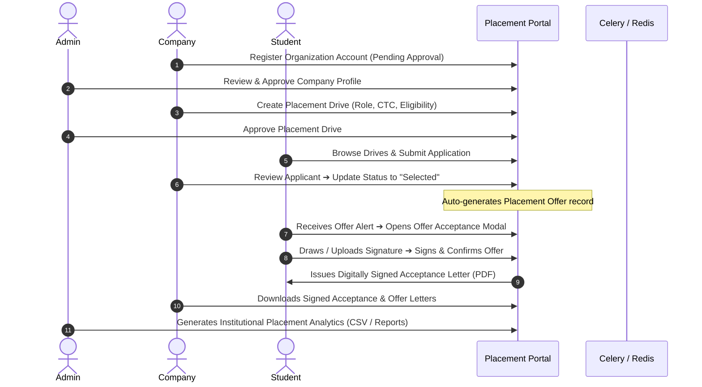
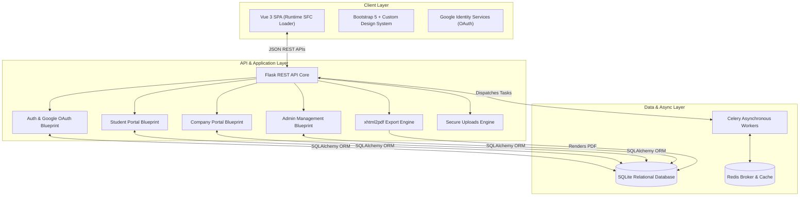

<div align="center">

# 🎓 Placement Portal Application

### *An Enterprise-Grade Campus Recruitment & Placement Automation Platform*

[](https://python.org)
[](https://flask.palletsprojects.com/)
[](https://vuejs.org/)
[](https://getbootstrap.com/)
[](https://sqlite.org/)
[](https://docs.celeryq.dev/)
[](https://redis.io/)
[](https://opensource.org/licenses/MIT)

</div>

---

## 📌 Table of Contents
- [Overview](#-overview)
- [Key Features](#-key-features)
- [Architecture & Tech Stack](#-architecture--tech-stack)
- [End-to-End Workflows](#-end-to-end-workflows)
- [System Architecture Diagram](#-system-architecture-diagram)
- [Recruitment Pipeline Flowchart](#-recruitment-pipeline-flowchart)
- [Database Schema](#-database-schema)
- [Project Directory Structure](#-project-directory-structure)
- [Installation & Quickstart Guide](#-installation--quickstart-guide)
- [API Endpoints Overview](#-api-endpoints-overview)
- [License](#-license)

---

## 🌟 Overview

**Placement Portal Application** is a full-stack campus recruitment management system designed to streamline, automate, and digitize university placement drives. It provides three dedicated, secure role-based portals for **University Administrators (TPO)**, **Corporate Recruiters (Companies)**, and **Student Candidates**.

The platform features modern authentication (**JWT + Google OAuth**), **digital signature capture** (canvas drawing and image upload), **executive PDF letter generation** (`xhtml2pdf`), **live notification center**, and **asynchronous data export** powered by Celery and Redis.

---

## 🚀 Key Features

### 👤 1. Role-Based Portals & Dashboards
- **🎓 Student Portal**:
  - Browse approved placement drives with eligibility checks (CGPA, Branch, Batch).
  - One-click application submission with resume linkage.
  - Interactive **Application Status Stepper** (`Applied` ➔ `Shortlisted` ➔ `Interview` ➔ `Selected` ➔ `Signed & Accepted`).
  - **Mandatory Digital Signature Acceptance**: Accept job offers with live canvas signature drawing or PNG/JPEG image upload.
  - Download official **Letter of Acceptance** and **Offer Letter** PDFs.
  - Manage student profile, academic records, and default signature.

- **🏢 Company Recruiter Portal**:
  - Profile registration with administrative verification gatekeeper.
  - Create and manage placement drives with salary packages, job descriptions, deadlines, and eligibility criteria.
  - Applicant pipeline review with status transitions and remarks.
  - Upload authorized signatory signature for automated embedding onto Offer Letters.
  - View real-time placement statistics and candidate acceptance records.

- **🛡️ Admin (TPO / Institute) Portal**:
  - Global overview dashboard with dynamic recruitment metrics and charts.
  - Review, approve, or reject new company registrations.
  - Moderate placement drives and monitor student application counts.
  - Full audit trail of verified placements with candidate and recruiter signature previews.
  - Manage student records, blacklisting controls, and institute-wide reporting.

### ✍️ 2. Digital Signatures & PDF Generation
- **Dual Signature Verification**: Supports candidate digital acceptance signatures and company authorized signatory signatures.
- **Canvas Signature Drawing**: Interactive touch/mouse drawing pad with clear and redo controls.
- **Image Signature Upload**: Supports `.png`, `.jpg`, `.jpeg`, `.webp` (up to 5MB) with base64 Data URI conversion.
- **Executive PDF Letterhead**: High-resolution, corporate-styled **Offer Letter** and **Letter of Acceptance** documents rendered dynamically with signature embeds.

### 🔐 3. Authentication & Security
- **Google Sign-In / OAuth**: Integrated Google Identity Services (GIS) for 1-click authentication and automated user provisioning.
- **JWT Authentication**: Secure stateless token authentication with expiration and role-based access control (RBAC).
- **Password Security**: Cryptographic hashing using PBKDF2 / bcrypt.

### ⚡ 4. Real-time Notifications & Async Jobs
- **Live Notifications Center**: Dynamic navbar drawer alerting users to new offers, application status changes, and drive postings.
- **Asynchronous Data Exports**: Celery background workers for generating heavy CSV export archives without blocking the user interface.

---

## 🛠️ Architecture & Tech Stack

| Layer | Technology | Purpose |
| :--- | :--- | :--- |
| **Backend API** | Flask 3.0+ (Python 3.10+) | Secure RESTful API provider and RBAC enforcement |
| **Database & ORM** | SQLite & Flask-SQLAlchemy | Relational database storage with schema migrations |
| **Frontend Framework** | Vue.js 3 & Vue Router 4 | Reactive Single Page Application (SPA) |
| **SFC Dynamic Loader** | `vue3-sfc-loader` | In-browser dynamic runtime compilation of `.vue` files without heavy Node.js build steps |
| **Styling & UI** | Vanilla CSS3, Bootstrap 5.3, Bootstrap Icons | Custom design system with glassmorphism, gradients, and micro-interactions |
| **PDF Generation** | `xhtml2pdf` | Server-side HTML-to-PDF rendering with embedded Base64 signatures |
| **Task Queue & Broker** | Celery 5.x & Redis | Background job processing, periodic tasks, and caching |
| **Authentication** | PyJWT & Google Identity Services | Stateless JSON Web Tokens & Google OAuth 2.0 |

---

## 🔄 End-to-End Workflows



---

## 📊 System Architecture Diagram



---

## 📁 Project Directory Structure

```text
Placement_PORTAL_APP/
├── backend/
│   ├── app.py                     # Flask Application Factory & Server Entry Point
│   ├── config.py                  # Environment & App Configuration
│   ├── extensions.py              # DB, Celery, Mail, Redis Initializers
│   ├── reset.py                   # Database Seeding & Mock Data Generator
│   ├── requirements.txt           # Python Dependencies
│   ├── models/                    # SQLAlchemy Database Models
│   │   ├── user.py                # User & Authentication Model
│   │   ├── student.py             # Student Profile Model
│   │   ├── company.py             # Company Profile Model
│   │   ├── drive.py               # Placement Drive Model
│   │   ├── application.py         # Job Application Model
│   │   └── placement.py           # Final Placement & Signature Model
│   ├── routes/                    # REST API Endpoints
│   │   ├── auth.py                # Login, Register, Google OAuth, Notifications
│   │   ├── student.py             # Student Operations & Offer Acceptance
│   │   ├── company.py             # Company Management & Drive Operations
│   │   ├── admin.py               # Institute Admin Control Center
│   │   ├── export.py              # PDF Letter Generation & CSV Status
│   │   └── upload.py              # Signature & Asset File Uploads
│   ├── tasks/                     # Celery Background Tasks
│   │   ├── exports.py             # CSV Export Background Workers
│   │   ├── reminders.py           # Scheduled Email & Notification Reminders
│   │   └── reports.py             # Monthly Analytics Report Generators
│   ├── templates/                 # HTML Templates & PDF Layouts
│   │   ├── index.html             # Single Page Application Entry HTML
│   │   ├── offer_letter.html      # Executive Offer Letter PDF Template
│   │   └── acceptance_letter.html # Signed Letter of Acceptance PDF Template
│   └── utils/                     # Helpers, Decorators, and Security
│       ├── decorators.py          # JWT @token_required & @role_required
│       ├── upload.py              # Signature Storage & Base64 Converter
│       └── validators.py          # Data Validation Utilities
├── frontend/
│   ├── src/
│   │   ├── app.js                 # Vue 3 App Initialization & Axios Interceptors
│   │   ├── router.js              # Vue Router Routes & Navigation Guards
│   │   └── components/            # Vue Single File Components (.vue)
│   │       ├── Navbar.vue         # Navigation Bar with Notification Center
│   │       ├── Login.vue          # Modern Glassmorphic Login with Google OAuth
│   │       ├── Register.vue       # Student & Company Registration
│   │       ├── StudentHistory.vue # Offer Acceptance & Signature Canvas Modal
│   │       ├── StudentApplications.vue # Application Pipeline & Stepper
│   │       ├── CompanyPlacements.vue   # Placement Roster & Signature Previews
│   │       └── AdminPlacements.vue     # Institute Placement Registry
│   └── static/
│       └── css/
│           └── custom.css         # Modern Design System (Plus Jakarta Sans & Inter)
├── LICENSE                        # MIT Open Source License
└── README.md                      # Project Documentation
```

---

## ⚡ Installation & Quickstart Guide

### Prerequisites
- **Python 3.10+**
- **pip** package manager
- *(Optional)* **Redis** server for background Celery tasks

### 1. Clone the Repository
```bash
git clone https://github.com/AnustupMaity/Placement_PORTAL_APP.git
cd Placement_PORTAL_APP
```

### 2. Create and Activate Virtual Environment
```bash
# Windows
python -m venv venv
venv\Scripts\activate

# macOS / Linux
python3 -m venv venv
source venv/bin/activate
```

### 3. Install Dependencies
```bash
pip install -r backend/requirements.txt
```

### 4. Initialize Database & Seed Demo Data
```bash
python backend/reset.py
```

### 5. Run the Application
```bash
python backend/app.py
```
Open your browser and navigate to:
👉 **`http://127.0.0.1:5000`**

*(Note: No Node.js / npm build step is required. The Vue 3 application compiles dynamically in the browser).*

---

## 🔑 Demo Login Credentials (Seeded)

| Role | Username | Password | Access Level |
| :--- | :--- | :--- | :--- |
| **🛡️ Admin** | `admin` | `admin123` | Full Institute Management |
| **🎓 Student** | `test_student_sig` | `pass123` | Student Dashboard & Offer Acceptance |
| **🏢 Company** | `test_comp_sig` | `pass123` | Recruiter Dashboard & Applicant Pipeline |

---

## 📡 API Endpoints Overview

| Method | Endpoint | Description | Access |
| :--- | :--- | :--- | :--- |
| `POST` | `/api/auth/login` | Authenticate with username/password | Public |
| `POST` | `/api/auth/google` | Authenticate / Register with Google OAuth | Public |
| `POST` | `/api/auth/register/student` | Register student account | Public |
| `POST` | `/api/auth/register/company` | Register company account (Pending approval) | Public |
| `GET` | `/api/notifications` | Dynamic live notification alerts | Authenticated |
| `POST` | `/api/upload/signature` | Upload signature image (`.png`, `.jpg`, `.webp`) | Authenticated |
| `PUT` | `/api/student/placements/<id>/accept` | Sign and accept employment offer | Student |
| `GET` | `/api/export/offer_letter/<id>` | Generate official Offer Letter PDF | Authorized |
| `GET` | `/api/export/acceptance_letter/<id>` | Generate signed Letter of Acceptance PDF | Authorized |
| `GET` | `/api/admin/placements` | List institute placement records | Admin |

---

## 📄 License

This project is open-source and licensed under the **[MIT License](LICENSE)**.

```
Copyright (c) 2026 Anustup Maity

Permission is hereby granted, free of charge, to any person obtaining a copy
of this software and associated documentation files (the "Software"), to deal
in the Software without restriction, including without limitation the rights
to use, copy, modify, merge, publish, distribute, sublicense, and/or sell
copies of the Software, and to permit persons to whom the Software is
furnished to do so, subject to the following conditions:

The above copyright notice and this permission notice shall be included in all
copies or substantial portions of the Software.
```

---

<div align="center">
  <sub>Built by <strong>Anustup Maity</strong></sub>
</div>
